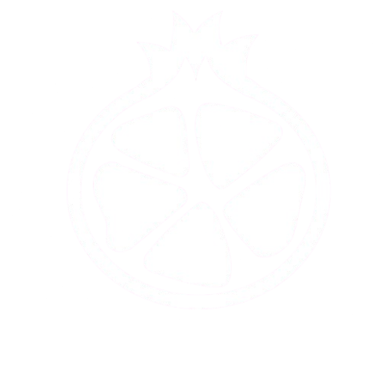

<p align="center">
    <picture>
        <source media="(prefers-color-scheme: light)" srcset="images/logo/pomeg-dark.png" width="250px"/>
        <source media="(prefers-color-scheme: dark)" srcset="images/logo/pomeg-white.png" width="250px"/>
        
    </picture>
    <br>
    
</p>

Pomegranate is an open-source processor design framework for rapid prototyping and education. It provides a library of portable and scalable VHDL modules that allow you to quickly experiment with various architectural designs.

The Pomegranate [wiki](https://github.com/Zachary-Pearce/Pomegranate/wiki) is the ideal place to start. It will guide you through the process of designing your first processor.

## Features
Pomegranate provides a highly configurable set of tools to simplify your design process:
* **Modular VHDL Library** - Build a custom processor by mixing and matching highly configurable modules (e.g. [ALUs](/src/ALU/), [memories](/src/Memory/) , and [I/O](/src/IO/GPIO%20Controller/)).
* **Configuration Packages** - Easily define and implement core architectural elements using specialised packages:
    * **[Instruction Set Config](/config/pomegranate_inst_conf.vhd)** - Define your Instruction Set Architecture (ISA), this can be a custom ISA or a pre-defined one like **RISCV**.
    * **[Memory Map Config](/config/pomegranate_memory_map_conf.vhd)** - Define memory-mapped peripherals and partition your memory.
* **Portable and Scalable** - All modules are designed to be as compatible with as many FPGA platforms as possible, they can also be scaled.

## Installation & Usage
1. Clone this repository

```bash
git clone https://github.com/Zachary-Pearce/Pomegranate.git
```

2. Import the [configuration packages](/config/) into your project and customise them according to the [configuration guide](https://github.com/Zachary-Pearce/Pomegranate/wiki/Configuring-Pomegranate).
3. Then import the required [modules](/src/) into your project. please ensure you read each module's documentation (e.g. The [GPIO controller](/src/IO/GPIO%20Controller/)) to understand their configuration rules.
4. Finally, instantiate your modules in a top file and connect them together to form your architecture.

### Compatibility & Performance
* You can view the known compatibility of any module in its testing documentation, this may not include your target architecture. However, we welcome [contributions](#contribution) to extend their compatibility. Please ensure any changes do not negatively impact existing compatibility.
* Pomegranate's modules are well optimised, however they may not meet the strict timing or resource requirements of a production-ready design. Pomegranate is best used for rapid prototyping, designers are encouraged to optimise their designs before production.

### Where to Get Support
If you encounter any issues while designing with Pomegranate or have any suggestions, feel free to open an issue.

## Contribution
Contribute to Pomegranate by submitting pull requests for modules or documentation and by answering issues. Please read the [contribution guidelines](/.github/CONTRIBUTING.md) before starting. Here's the basic process:

1. Fork this repository
2. Clone your fork
3. Make your changes
4. Submit your pull request

We expect any pull requests to come with full justification for their changes as well as functional verification at the minimum, so please ensure you have read any relevant documentation first.

> [!IMPORTANT]
> Please ensure you follow the [Code of Conduct](/.github/CODE_OF_CONDUCT.md) when submitting any pull requests or answering issues.
